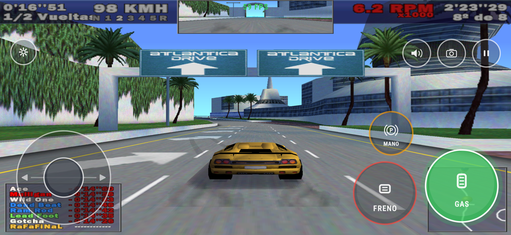
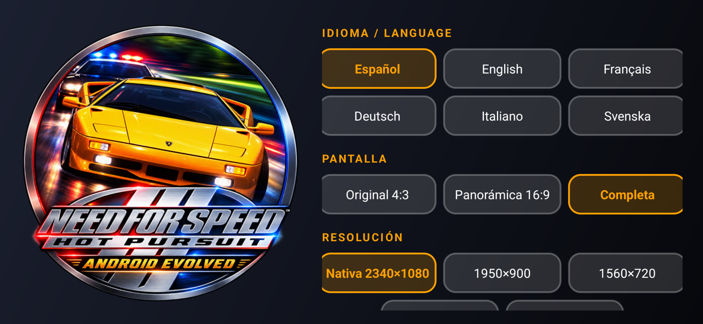
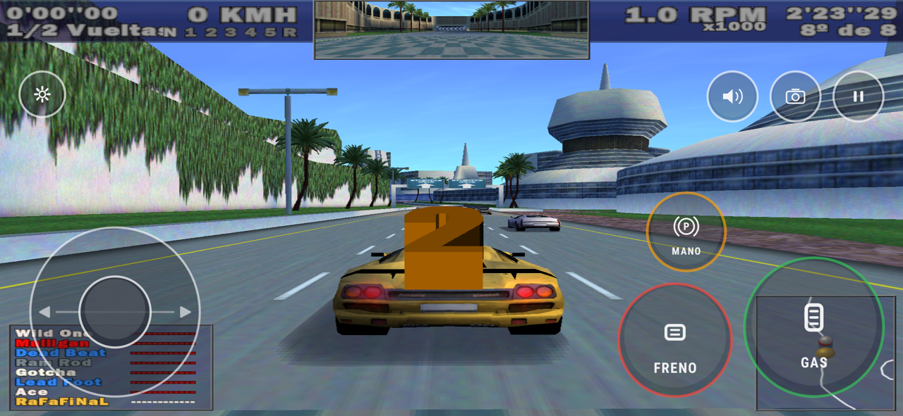
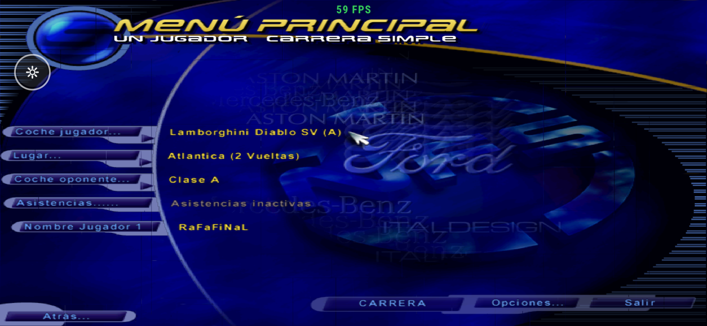

# NFS3 HP Android Evolved

**Need for Speed III: Hot Pursuit nativo en Android (ARM64)**, con el
**NFS3 Modern Patch v1.6.1** integrado, controles táctiles pensados para jugar y
soporte para mandos.

No es un emulador: el ejecutable del juego está **recompilado estáticamente** de x86
a C++ y compilado para ARM64, así que corre a velocidad nativa. Los archivos
originales del juego **no se incluyen**: necesitas tu propia copia de NFS3.

<p>


</p>
<p>


</p>

## Características

- **Modern Patch 1.6.1 de VEG** recompilado: sus correcciones, menús, HUD y textos.
- **Menú de inicio** para elegir antes de jugar:
  - idioma: español, inglés, francés, alemán, italiano y sueco;
  - pantalla: original 4:3, 16:9 o completa;
  - resolución: hasta la nativa del móvil; el 3D se dibuja a esa altura aunque el juego trabaje a 640×480;
  - límite de FPS, con contador opcional.
- **Menús táctiles**: se tocan las opciones directamente. El gesto **Atrás** equivale a Esc
  (volver, pausar y saltar cinemáticas).
- **Controles de carrera** que aparecen solos al empezar una carrera:
  - joystick analógico y GAS / FRENO / MANO;
  - bocina, cámara y pausa;
  - multitáctil real: puedes deslizar el dedo de un botón a otro.
- **Ajustes de dirección**: también botones, deslizar o inclinación, con curva de
  respuesta, zona muerta, tamaño, opacidad, modo zurdo, vibración y un editor para
  mover y redimensionar los botones.
- **Mandos Bluetooth/USB**: gatillos progresivos y dirección analógica. Al usar el mando
  se ocultan los controles táctiles y vuelven al tocar la pantalla.
- **Rendimiento**: compilado en Release `-O2`, render GLES 3 optimizado y frecuencia de
  pantalla fijada según el límite de FPS.

## Requisitos

- Android 8.0 o superior, procesador **ARM64**, OpenGL ES 3.
- Tu copia de **Need for Speed III: Hot Pursuit** (carpetas `fedata` y `gamedata`, y `nfs3.exe`).
- Los datos del **NFS3 Modern Patch v1.6.1** (`fedata` y `gamedata` del parche).

Probado en Samsung Galaxy S25 Ultra (Android 16) y Xiaomi Redmi Note 8; en el Redmi va
a 59-60 FPS a resolución nativa.

## Instalación

1. Descarga el APK desde [Releases](../../releases) e instálalo.
2. Copia tus archivos del juego a la memoria interna, en
   **`/storage/emulated/0/nfs3hpandroidevolved/`**:

   ```text
   nfs3hpandroidevolved/
   ├── nfs3.exe        (solo se lee, no se ejecuta)
   ├── fedata/
   └── gamedata/
   ```

   Usa la instalación de tu PC (o `fedata`/`gamedata` del CD) y copia encima los
   `fedata`/`gamedata` del Modern Patch 1.6.1. Desde un PC con ADB:

   ```bash
   adb push fedata gamedata nfs3.exe /sdcard/nfs3hpandroidevolved/
   python scripts/copy-modern-patch-data.py /ruta/al/ModernPatch
   ```
3. Abre la app, concede el **acceso a archivos** y pulsa **JUGAR**. El launcher crea
   `install.win`, `nfs3.ini` y la configuración del driver si faltan.

## Controles

| Táctil | Mando | Juego |
|---|---|---|
| Joystick (o botones / deslizar / inclinación) | Stick izquierdo o cruceta | Dirección |
| GAS / FRENO | RT / LT (progresivos) | Acelerar / frenar |
| MANO | X | Freno de mano |
| Cámara · Bocina · Pausa | Y · Select · Start | Cámara · bocina · pausa |
| — | LB / RB | Marcha − / + |
| Tocar el menú · gesto Atrás | A · B | Aceptar · volver |

El botón ⚙ abre los ajustes de controles durante la partida.

## Compilar

Necesitas Android Studio (JDK 17+), SDK 35, NDK **27.2.12479018**, CMake **3.30.5**,
Git y Python 3.

```powershell
./scripts/build-android.ps1        # Windows
bash scripts/build-android.sh      # Linux / WSL
```

El APK queda en `android/app/build/outputs/apk/release/app-release.apk`, firmado con
la clave de depuración. Por defecto se compila el Modern Patch; con
`gradlew -p android assembleRelease -PoriginalExe` se compila el ejecutable original.

Los detalles técnicos están en [ANDROID.md](ANDROID.md). Ahí se explica cómo se
recompila el parche (`disassemble_nfs3hp_modern.py`), las funciones de Windows añadidas
y el diagnóstico.

## Cómo funciona

`disasm/` traduce cada instrucción x86 del `.exe` a C++ y `src/lib/` reimplementa las
partes de Windows que usa el juego sobre SDL2 y OpenGL ES:
- DirectDraw, DirectInput y DirectSound;
- Glide 2;
- kernel32 y user32.

El Modern Patch modifica el `.exe` en el sitio, así que se recompila con las mismas
pistas que el original. Hubo que ajustar las zonas donde Veg cambió código por datos o
datos por código.

## Limitaciones conocidas

- Sin panorámica real (Hor+): el modo Completa estira la imagen 4:3. El parche solo
  ensancha el campo de visión con su propio driver Glide 3, que este runtime no implementa.
- El juego está pensado para 60 FPS; por encima puede comportarse de forma rara.
- El multijugador en red no está probado.

## Créditos

- [motor-dev/nfs-recompiled](https://github.com/motor-dev/nfs-recompiled): la
  recompilación estática en la que se basa este port. Su documentación original está en
  [docs/UPSTREAM.md](docs/UPSTREAM.md).
- [NFS3 Modern Patch](http://veg.by/en/projects/nfs3/) de Evgeny Vrublevsky (VEG).
- [SDL 2](https://github.com/libsdl-org/SDL) y [sse2neon](https://github.com/DLTcollab/sse2neon).
- Need for Speed es una marca de Electronic Arts. Este proyecto no está afiliado a EA
  y no distribuye ningún archivo del juego.
